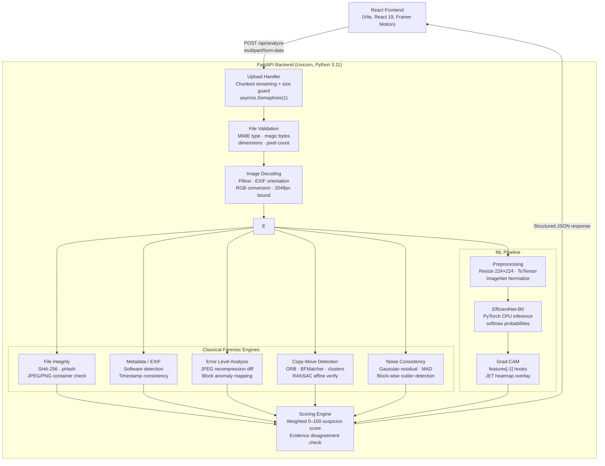

# PixelProof

**Digital Image Forensics & Authenticity Verification**

PixelProof combines classical computer-vision forensics with machine-learning inference to analyze digital images for evidence of manipulation. Five independent forensic modules examine different aspects of an image — compression artifacts, feature duplication, noise consistency, metadata integrity, and file structure — and their findings are aggregated alongside a separate EfficientNet-B0 classification signal into a unified forensic report.

---

🌐 **Live Demo:** [https://pixelproof-1.onrender.com/](https://pixelproof-1.onrender.com/)

> [!IMPORTANT]
> Forensic indicators and ML probabilities are **evidence signals**, not absolute proof of manipulation. The system's output should be interpreted as a starting point for manual review, not as a definitive verdict.

---

## Table of Contents

1. [Project Overview](#1-project-overview)
2. [Key Features](#2-key-features)
3. [Analysis Pipeline](#3-analysis-pipeline)
4. [Forensic Analysis Layers](#4-forensic-analysis-layers)
5. [Forensic Score & Verdict](#5-forensic-score--verdict)
6. [AI / Machine Learning](#6-ai--machine-learning)
7. [Grad-CAM Explainability](#7-grad-cam-explainability)
8. [Evidence Disagreement](#8-evidence-disagreement)
9. [SHA-256 & Perceptual Hash](#9-sha-256--perceptual-hash)
10. [Technology Stack](#10-technology-stack)
11. [Architecture Diagram](#11-architecture-diagram)
12. [Project Structure](#12-project-structure)
13. [Local Installation](#13-local-installation)
14. [Usage](#14-usage)
15. [API Reference](#15-api-reference)
16. [Deployment](#16-deployment)
17. [Limitations](#17-limitations)
18. [Security & Privacy](#18-security--privacy)
19. [Future Improvements](#19-future-improvements)
20. [License](#20-license)

---

## 1. Project Overview

Digital image authenticity is difficult to assess with the naked eye. Modern editing software can alter, splice, or clone regions of an image while leaving no visible seams. PixelProof addresses this by running multiple independent forensic analyses on a single uploaded image and combining their evidence into a structured report.

**Why multiple layers matter:** No single forensic technique is definitive. JPEG compression and natural scene properties can produce false positives in individual detectors. By requiring corroborating evidence across several independent modules — recompression error, feature duplication geometry, noise consistency, metadata provenance, and ML pattern recognition — PixelProof reduces the chance of drawing incorrect conclusions from any one signal in isolation.

---

## 2. Key Features

| Feature | Description |
|---|---|
| **Image upload** | Drag-and-drop or file-picker upload of JPEG, PNG, and WebP images (up to 25 MB) |
| **Multi-layer forensic analysis** | Five independent classical forensic modules run in parallel |
| **Metadata / EXIF analysis** | Extracts camera hardware tags, editing-software traces, and EXIF timestamp consistency |
| **Error Level Analysis (ELA)** | Recompresses the image at a known quality level and maps localized recompression discrepancies |
| **Copy-move detection** | ORB feature extraction, descriptor cross-matching, displacement-vector clustering, and RANSAC geometric verification |
| **Noise consistency analysis** | Block-wise noise floor estimation using Gaussian residual and Median Absolute Deviation (MAD) |
| **File integrity & container check** | Validates JPEG SOI/EOI and PNG signature/IEND byte markers |
| **SHA-256 fingerprint** | Cryptographic hash of the uploaded file bytes for exact identification |
| **Perceptual hash (pHash)** | 64-bit DCT perceptual hash for visual similarity matching |
| **EfficientNet-B0 ML inference** | Independent deep-learning classification signal (authentic / manipulated) |
| **Grad-CAM influence map** | Heatmap overlay highlighting which image regions influenced the model's classification |
| **Evidence disagreement detection** | Flags when the ML signal and classical forensic evidence point in opposite directions |
| **Forensic evidence score** | Weighted 0–100 suspicion score from the five classical modules |
| **Responsive React frontend** | Single-page application with Home, Analyze, Results, and How It Works views |
| **Animated loading state** | Real-time progress feedback during analysis |

---

## 3. Analysis Pipeline

```
User uploads image (JPEG / PNG / WebP, ≤ 25 MB)
        ↓
React Frontend (Vite + React 19)
        ↓
POST /api/analyze — chunked streaming upload (64 KB chunks)
        ↓
File size guard & early byte counter (rejects > 25 MB immediately)
        ↓
File validation — MIME type, magic bytes, dimensions, pixel count
        ↓
Pillow image decoding — EXIF orientation correction, RGB conversion
        ↓
Memory bounding — images > 2048 px downscaled before NumPy allocation
        ↓
In-process concurrency guard — asyncio.Semaphore(1), thread-pool offload
        ↓
┌─────────────────────────────────────────────────────────────┐
│                   Forensic Analysis (parallel)              │
│  ┌─────────────────────┐  ┌─────────────────────────────┐  │
│  │ 1. File Integrity   │  │ 4. Copy-Move Detection      │  │
│  │    SHA-256 + pHash  │  │    ORB → BFMatcher →        │  │
│  │    container check  │  │    vector clustering →       │  │
│  └─────────────────────┘  │    RANSAC affine verify     │  │
│  ┌─────────────────────┐  └─────────────────────────────┘  │
│  │ 2. Metadata / EXIF  │  ┌─────────────────────────────┐  │
│  │    software traces  │  │ 5. Noise Consistency        │  │
│  │    timestamp check  │  │    Gaussian residual        │  │
│  └─────────────────────┘  │    block-wise MAD           │  │
│  ┌─────────────────────┐  └─────────────────────────────┘  │
│  │ 3. ELA              │                                    │
│  │    JPEG recompress  │                                    │
│  │    block anomaly    │                                    │
│  └─────────────────────┘                                    │
└─────────────────────────────────────────────────────────────┘
        ↓
ML Preprocessing — Resize(224×224) → ToTensor → Normalize(ImageNet)
        ↓
EfficientNet-B0 inference (PyTorch CPU)
        ↓
Softmax → authentic_probability / manipulated_probability
        ↓
Grad-CAM — forward + backward hooks on model.features[-1]
        ↓
Evidence Aggregation — Scoring Engine (0–100 forensic suspicion score)
        ↓
Evidence Disagreement check — ML vs classical forensic signals
        ↓
Structured JSON response → React Results page
        ↓
Image matrices deleted + gc.collect()
```

---

## 4. Forensic Analysis Layers

### 4.1 File Integrity & Container Verification

**Max contribution:** 5 points

Validates the raw byte structure of the uploaded container:

- **JPEG:** checks for Start of Image (`FF D8`) and End of Image (`FF D9`) markers.
- **PNG:** checks for the standard 8-byte PNG signature and the mandatory `IEND` terminator chunk. Trailing bytes after `IEND` are flagged as a possible hidden payload.

This check catches truncated files, appended data, and container-level corruption. It does not indicate pixel-level manipulation by itself.

**Libraries:** `hashlib` (SHA-256), custom byte-inspection logic via Python built-ins.

---

### 4.2 Metadata & EXIF Analysis

**Max contribution:** 15 points

Extracts and evaluates EXIF, TIFF, and container metadata tags using Pillow's `getexif()` and, as a fallback, the private `_getexif()` method. Sub-IFD (where `DateTimeOriginal` and `DateTimeDigitized` typically reside) is also inspected.

**What is checked:**

| Check | Detail |
|---|---|
| Camera hardware tags | `Make`, `Model` — presence indicates original camera acquisition |
| Editing software traces | Matches `Software` tag against a known-editor list: Photoshop, GIMP, Lightroom, Canva, Snapseed, Pixlr, Paint.NET, Photopea, Affinity, CorelDRAW, Pixelmator, Procreate, VSCO, Facetune, PicsArt, AfterFocus |
| Timestamp chronological consistency | Validates that `DateTimeOriginal` ≤ `DateTime` ≤ future boundary; flags inversions and future-dated timestamps |
| PNG `tEXt` / JPEG comment chunks | Software name extracted from PIL `.info` dictionary as fallback |
| GPS tags | Presence noted (value protected, not exposed) |

> [!NOTE]
> Software tags record what application last saved the file. A Photoshop tag confirms the file was processed through Photoshop, but does not distinguish between creative export and forensic manipulation. Metadata can also be stripped by messaging apps, social media platforms, and screenshot tools, so its absence is not manipulation evidence on its own.

---

### 4.3 Error Level Analysis (ELA)

**Max contribution:** 30 points

ELA detects localized differences in JPEG compression history.

**How it works:**

1. The image is internally recompressed at JPEG quality 90 using `io.BytesIO` (no disk writes).
2. The absolute pixel-wise difference between the original and the recompressed version is computed with `cv2.absdiff`.
3. A block-based analysis divides the image into tiles and measures the mean recompression error per block.
4. Blocks that are statistical outliers — both Z-score > 2.4 and absolute mean > 3.0 above the image baseline — are counted as anomalous.
5. A secondary quality sweep at JPEG qualities 75, 85, 90, and 95 is run at thumbnail resolution (≤ 512 px) to assess error-level gradient across quality settings.

**Scoring thresholds:**

| Condition | Status | Score (JPEG / non-JPEG) |
|---|---|---|
| anomaly\_ratio > 7% AND max\_diff > 16 AND bm\_std > 1.5 | STRONG LOCAL VARIATION | 22 / 16 |
| anomaly\_ratio > 3.5% OR (> 5% with std > 1.1) | MODERATE VARIATION | 12 / 8 |
| Otherwise | LOW VARIATION | 2 / 1 |

> [!NOTE]
> ELA is most reliable on JPEG images. Non-JPEG inputs (PNG, WebP) undergo JPEG conversion before analysis, which introduces a baseline recompression shift that reduces signal specificity. Natural sharp edges, high-contrast text, and smooth skies can also produce localized ELA variation that does not indicate manipulation.

---

### 4.4 Copy-Move Cloning Detection

**Max contribution:** 30 points

Detects duplicate regions within the same image using ORB keypoint descriptors, displacement-vector clustering, and RANSAC geometric verification.

#### ORB Feature Extraction

**ORB** = Oriented FAST and Rotated BRIEF

ORB detects up to 2,000 stable keypoints per image (scale factor 1.2, 8 pyramid levels, edge threshold 15, FAST threshold 12). Each keypoint is described by a binary descriptor, making matching fast and memory-efficient.

#### Descriptor Cross-Matching

A `cv2.BFMatcher` with Hamming distance finds the top 6 nearest neighbours for every descriptor **within the same image**. Only pairs where:
- Hamming distance ≤ 36 (high-confidence match)
- Euclidean spatial distance ≥ `max(40px, 5% of shorter dimension)` (spatially separated)

are retained as valid candidate pairs.

#### Displacement-Vector Clustering

In genuine copy-move forgery, a cloned patch is translated by a **single consistent vector** (dx, dy). Valid pairs are grouped into clusters where the canonical displacement vectors agree within a tolerance of `max(18px, 3% of shorter dimension)`. Natural repetitive textures (brick walls, window grids, foliage) produce many small, diffuse clusters with scattered vectors rather than a single dominant cluster.

#### RANSAC Geometric Verification

**RANSAC** = Random Sample Consensus

`cv2.estimateAffinePartial2D` with RANSAC fits an affine-partial transform (scale + rotation + translation) to the dominant cluster's source and destination points. This catches rotated or scaled clone patches that pure translation clustering would miss. A match is accepted as RANSAC-verified only when:
- Scale: 0.35× – 2.8×
- Translation distance ≥ 60% of the spatial separation threshold
- ≥ 10 inliers with inlier ratio ≥ 18%
- Inlier points are spatially spread (bounding box ≥ 20 px)
- Pattern does not match diffuse periodic texture

> [!NOTE]
> Natural repetitive textures (tiled floors, grids of windows, uniform foliage) can generate many descriptor matches without indicating cloning. The detector distinguishes between localized cloning (dominant concentrated cluster) and diffuse periodic texture (many small scattered groups). False positives remain possible for images with strong geometric regularity.

---

### 4.5 Noise Consistency Analysis

**Max contribution:** 20 points

Detects local noise-floor anomalies that may indicate spliced regions, airbrushed retouching, or compositing from sources with different sensor characteristics.

**How it works:**

1. A high-frequency residual map is extracted by subtracting a Gaussian blur (5×5, σ=1.0) from the grayscale image.
2. A Sobel edge magnitude map identifies high-gradient (edge) pixels. Non-edge (flat) pixels are used to measure the pure sensor noise floor, suppressing contamination from structural edges.
3. For each image block, the noise sigma is estimated using **Median Absolute Deviation (MAD)**: `σ = MAD / 0.6745` — a robust estimator that is resistant to pixel outliers.
4. Blocks whose noise sigma deviates from the image-wide median beyond `max(1.8 × IQR, 1.2)` are flagged as outliers.
5. The coefficient of quartile dispersion (`IQR / median`) summarizes overall noise uniformity.

A scientific perceptually-uniform colormap (COLORMAP_CIVIDIS) is applied to the noise heatmap. Warmer tones reflect higher local noise variance relative to the image baseline, not confirmed manipulation.

> [!NOTE]
> Legitimate reasons for noise variation include optical depth of field (shallow bokeh vs sharp foreground), smooth gradient regions (clear sky), heavy JPEG compression, or natural variation in scene luminance. Noise inconsistency is one forensic signal among several.

---

## 5. Forensic Score & Verdict

The **Scoring Engine** combines the five classical module scores into a single 0–100 suspicion index:

| Module | Max Score |
|---|---|
| Metadata & EXIF Analysis | 15 |
| Error Level Analysis (ELA) | 30 |
| Copy-Move Cloning Detection | 30 |
| Noise Consistency Analysis | 20 |
| File Integrity & Container | 5 |
| **Total** | **100** |

**Score thresholds:**

| Score Range | Verdict | Meaning |
|---|---|---|
| 0–29 | Low Suspicion | Forensic analysis found no strong indicators of manipulation |
| 30–59 | Review Recommended | Several indicators warrant closer inspection |
| 60–100 | Strong Manipulation Indicators | Multiple modules report corroborating anomalies |

> [!IMPORTANT]
> The ML classification signal is **completely independent** and is **never added** to the 0–100 classical forensic score (`score_added = 0`). The score is composed strictly of the five classical modules. It represents the strength of detected forensic indicators based on heuristic evidence weights, not the statistical probability that the image is fake.

**Evidence quality** (Low / Moderate / High) is assessed separately based on image pixel count, EXIF availability, and cross-module corroboration — reflecting how much reliable forensic information was available, not the score itself.

---

## 6. AI / Machine Learning

### Model Architecture

| Property | Value |
|---|---|
| **Base architecture** | `torchvision.models.efficientnet_b0(weights=None)` |
| **Classifier head** | `Dropout(0.4) → Linear(1280, 256) → ReLU → Dropout(0.3) → Linear(256, 2)` |
| **Input size** | 224 × 224 pixels, RGB |
| **Normalization** | ImageNet mean `[0.485, 0.456, 0.406]`, std `[0.229, 0.224, 0.225]` |
| **Output** | 2-class raw logits → softmax → `[authentic_probability, manipulated_probability]` |
| **Class map** | Index 0 = `authentic`, Index 1 = `manipulated` |
| **Weights file** | `backend/app/models/image_forensics_model.pth` |
| **Model version** | `pixelproof-casia-v1` |
| **Framework** | PyTorch (CPU-only on Render) |
| **Device selection** | CUDA → MPS → CPU with automatic fallback |

### Preprocessing Pipeline

```python
transforms.Compose([
    transforms.Resize((224, 224)),
    transforms.ToTensor(),
    transforms.Normalize(
        mean=[0.485, 0.456, 0.406],
        std=[0.229, 0.224, 0.225]
    )
])
```

### Inference

Forward pass runs under `torch.inference_mode()` with no gradient computation. Softmax probabilities are rounded to 4 decimal places. Intermediate tensors (logits, probabilities) are deleted immediately after use.

### Training Dataset & Held-Out Test Metrics

The model was fine-tuned on the **CASIA 2.0** image tampering dataset, which contains splicing and copy-move manipulation examples.

**Dataset split:** 70 / 15 / 15 (train / validation / held-out test)

| Split | Images |
|---|---|
| Training | 8,829 |
| Validation | 1,892 |
| Held-out test | 1,893 |

**Held-out test set performance:**

| Metric | Value |
|---|---|
| Accuracy | 69.62% |
| Precision | 59.42% |
| Recall | 79.58% |
| F1 Score | 68.04% |
| ROC-AUC | 76.36% |

> [!WARNING]
> These metrics evaluate benchmark generalization on CASIA 2.0 test images only. They do not represent per-image confidence on in-the-wild photography, AI-generated imagery, or social-media-compressed images. The model is not an AI-generated image detector — it detects traditional digital manipulation artifacts (splicing, cloning) as represented in the CASIA 2.0 dataset.

### Lazy Loading

The model is loaded on first inference demand (lazy initialization), not at startup. This allows the FastAPI server to bind to its port immediately, preventing Render cold-start timeouts. Once loaded, the singleton instance is reused for all subsequent requests.

**PyTorch** — serves as the ML/deep-learning inference framework.\
**Torchvision** — provides the EfficientNet-B0 architecture definition and standardized image preprocessing transforms.\
**EfficientNet-B0** — a compound-scaled convolutional neural network that achieves a practical balance between classification accuracy and computational efficiency, making it suitable for CPU inference on memory-constrained deployments.

---

## 7. Grad-CAM Explainability

**Grad-CAM** = Gradient-weighted Class Activation Mapping

After inference, PixelProof computes a Grad-CAM influence heatmap for the predicted class. This visualizes which spatial regions of the image contributed more strongly to the model's selected classification.

**Implementation:**

1. Forward and backward hooks are registered on `model.features[-1]` (the final feature block of EfficientNet-B0).
2. A forward pass computes activations and class logits.
3. A backward pass computes gradients of the target class score with respect to the feature activations.
4. Channel-wise global average pooling of gradients produces attention weights: `weights = mean(gradients, dims=(H, W))`.
5. A weighted sum of activation maps is computed and ReLU-activated: `CAM = ReLU(Σ weights × activations)`.
6. The resulting 7×7 CAM is upsampled to the display image size and blended with the original image using `cv2.COLORMAP_JET`.
7. Hooks are removed and `model.zero_grad(set_to_none=True)` is called in a `finally` block to prevent gradient accumulation.

The overlay is rendered at ≤ 640 px to avoid allocating large uncompressed arrays on the 512 MB Render instance.

> [!CAUTION]
> Grad-CAM shows **which regions influenced the model's decision**, not which regions were edited. A highlighted area does not confirm that those pixels were manipulated. The heatmap is an explainability tool for the neural network's reasoning, not a forensic localization tool.

---

## 8. Evidence Disagreement

The forensic scoring engine and the ML classifier operate completely independently. When their conclusions conflict, PixelProof surfaces an **Evidence Disagreement** notice rather than silently resolving it.

**Example scenario:**

```
Classical Forensic Score:  18 / 100  →  Low Suspicion
ML Classifier:             Manipulated (61.4% manipulated probability)
```

In this case, the ML signal leans toward manipulation while classical forensic modules found limited direct evidence. PixelProof flags this as `EVIDENCE DISAGREEMENT` and recommends manual review.

Disagreement is detected in three conditions:

| Condition | Disagreement |
|---|---|
| ML → manipulated AND classical score < 30 | Yes |
| ML → authentic AND classical score ≥ 60 | Yes |
| ML → authentic AND classical score ≥ 30 | Yes |

> [!IMPORTANT]
> A manipulated\_probability of 61.4% means the model's output softmax score for the "manipulated" class is 0.614. It does not mean the image is 61.4% fake. The ML signal is one independent evidence source among several and should not be interpreted in isolation.

---

## 9. SHA-256 & Perceptual Hash

### SHA-256 — Cryptographic Fingerprint

**SHA-256** = Secure Hash Algorithm, 256-bit output

```
Uploaded image bytes
        ↓
hashlib.sha256(file_bytes).hexdigest()
        ↓
64-character hexadecimal fingerprint
```

- Identical byte sequences always produce the identical hash.
- Any byte-level change produces a completely different hash.
- SHA-256 establishes the exact cryptographic identity of the uploaded file.
- SHA-256 does **not** determine whether an image is authentic or manipulated.

### Perceptual Hash (pHash) — Visual Fingerprint

A 64-bit DCT perceptual hash is computed alongside SHA-256:

1. Image is converted to grayscale and resized to 32×32.
2. A 2D Discrete Cosine Transform (DCT) is computed.
3. The top-left 8×8 lowest-frequency coefficients are retained.
4. Each bit in the 64-bit hash represents whether a coefficient is above or below the median of AC components.

pHash is robust against minor recompression, format conversion, and small dimension changes — unlike SHA-256, which changes with any byte modification. pHash enables visual similarity matching independent of compression history.

---

## 10. Technology Stack

### Backend

| Technology | Version Constraint | Purpose |
|---|---|---|
| **FastAPI** | ≥ 0.115.0 | REST API layer — routing, validation, async request handling |
| **Uvicorn** | ≥ 0.30.0 | ASGI server serving the FastAPI application |
| **python-multipart** | ≥ 0.0.9 | Multipart form-data parsing for file uploads |
| **Pillow (PIL)** | ≥ 10.4.0 | Image decoding, RGB conversion, EXIF extraction, JPEG recompression |
| **NumPy** | ≥ 2.0.0 | Pixel-level mathematical and statistical computation |
| **OpenCV (headless)** | ≥ 4.10.0 | Feature detection (ORB), descriptor matching, geometric verification (RANSAC), image filtering, colormap application |
| **PyTorch** | ≥ 2.0.0 | Deep-learning inference framework (CPU-only build) |
| **Torchvision** | ≥ 0.15.0 | EfficientNet-B0 architecture, standardized image preprocessing transforms |
| **hashlib** | stdlib | SHA-256 cryptographic fingerprint generation |
| **io / BytesIO** | stdlib | In-memory image processing without temporary disk writes |
| **asyncio** | stdlib | Async upload streaming, concurrency guard (`Semaphore`) |

### Frontend

| Technology | Version | Purpose |
|---|---|---|
| **React** | 19.x | Single-page application framework |
| **Vite** | 8.x | Development server and production build tool |
| **Framer Motion** | 13.x | Animated transitions and loading state animations |
| **Lucide React** | 1.x | Icon library |
| **Vanilla CSS** | — | Styling — no CSS framework |

### Python Runtime

| Setting | Value |
|---|---|
| Python version | 3.11.9 (pinned via `.python-version`) |

---

## 11. Architecture Diagram



---

## 12. Project Structure

```
PixelProof/
├── LICENSE                              MIT License
├── README.md                            This file
├── DEPLOYMENT_RENDER_512MB.md           Render deployment configuration reference
├── FINAL_VALIDATION_REPORT.md           Internal validation notes
├── ML_NOTEBOOK_INTEGRATION.md          ML training integration notes
├── controlled_forensics_results.json   Internal test results
├── .python-version                      Root Python version pin (3.11.9)
│
├── backend/                             FastAPI backend service
│   ├── .python-version                  Backend Python version pin
│   ├── requirements.txt                 Python dependencies
│   ├── test_audit_hardening.py          Security and input validation tests
│   ├── test_controlled_forensics.py     Controlled forensic pipeline tests
│   ├── test_forensic_pipeline.py        End-to-end pipeline tests
│   ├── test_memory_and_concurrency.py   Memory safety and concurrency tests
│   ├── test_ml_integration.py           ML model integration tests
│   └── app/
│       ├── __init__.py
│       ├── main.py                      FastAPI app — CORS, router mount, /api/health
│       ├── models/
│       │   ├── image_forensics_model.pth  EfficientNet-B0 trained weights (gitignored)
│       │   ├── model_metadata_template.json
│       │   └── README.md                  Model spec and benchmark metrics
│       ├── routes/
│       │   └── analysis.py              POST /api/analyze — pipeline orchestration
│       ├── services/
│       │   ├── file_analyzer.py         SHA-256, pHash, container byte check
│       │   ├── metadata_analyzer.py     EXIF/TIFF extraction and evaluation
│       │   ├── ela_analyzer.py          Error Level Analysis
│       │   ├── copy_move_detector.py    ORB + RANSAC copy-move detection
│       │   ├── noise_analyzer.py        Block-wise MAD noise consistency
│       │   ├── ml_detector.py           EfficientNet-B0 inference + Grad-CAM
│       │   └── scoring_engine.py        Evidence aggregation and scoring
│       └── utils/
│           ├── image_utils.py           Safe image loading, base64 encoding, pHash, bounding
│           └── validators.py            File size, MIME, dimension, pixel-count validation
│
└── frontend/                            React single-page application
    ├── index.html                       HTML entry point
    ├── package.json                     npm dependencies and scripts
    ├── vite.config.js                   Vite config with /api proxy to localhost:8000
    ├── .env.example                     Environment variable template
    └── src/
        ├── main.jsx                     React DOM root mount
        ├── App.jsx                      Root component — page router (home / analyze / results / how-it-works)
        ├── styles.css                   Global stylesheet
        ├── index.css                    Base resets and variables
        ├── App.css                      App-level styles
        ├── pages/
        │   ├── Home.jsx                 Landing page
        │   ├── Analyze.jsx              Upload trigger page
        │   ├── Results.jsx              Analysis results page
        │   └── HowItWorks.jsx           Explainer page
        ├── components/
        │   ├── Navbar.jsx               Navigation bar
        │   ├── Footer.jsx               Footer
        │   ├── UploadZone.jsx           Drag-and-drop / file-picker + analysis trigger
        │   ├── LoadingAnalysis.jsx      Animated progress feedback
        │   ├── ScoreGauge.jsx           0–100 forensic score display
        │   ├── EvidenceCard.jsx         Per-module evidence card
        │   ├── ForensicViewer.jsx       ELA / copy-move / noise visualization viewer
        │   ├── MetadataPanel.jsx        EXIF metadata display panel
        │   ├── MLClassificationCard.jsx ML signal + Grad-CAM display
        │   └── DigitalFingerprint.jsx   SHA-256 / pHash / file info panel
        └── services/
            └── api.js                   Fetch client — checkBackendHealth / analyzeImageFile
```

---

## 13. Local Installation

### Prerequisites

- **Python 3.11.x** (recommended via `.python-version`)
- **Node.js 18+** and **npm**
- Sufficient disk space for PyTorch CPU wheels (~800 MB) and model weights (~17 MB)

### Backend Setup

```bash
# Clone the repository
git clone https://github.com/Prince94-p/PixelProof.git
cd PixelProof

# Create and activate a virtual environment
cd backend
python3 -m venv venv
source venv/bin/activate        # macOS / Linux
# venv\Scripts\activate         # Windows

# Install PyTorch CPU-only wheels (avoids ~2.5 GB CUDA packages)
pip install --upgrade pip
pip install torch torchvision --index-url https://download.pytorch.org/whl/cpu

# Install remaining dependencies
pip install -r requirements.txt
```

#### Model Weights

The trained EfficientNet-B0 weights (`image_forensics_model.pth`, ~17 MB) are not committed to the repository. Download them from the GitHub release:

```bash
mkdir -p app/models
curl -L -o app/models/image_forensics_model.pth \
  https://github.com/Prince94-p/PixelProof/releases/download/v1.0.0/image_forensics_model.pth
```

If the weights file is absent, the backend continues to operate — all five classical forensic modules remain fully functional. Only the ML inference and Grad-CAM sections of the response will indicate that the model is unavailable.

#### Start the Backend

```bash
# From the backend/ directory with the virtualenv active
uvicorn app.main:app --host 0.0.0.0 --port 8000 --workers 1
```

> [!WARNING]
> Do **not** increase `--workers` above `1`. Multiple Uvicorn workers duplicate PyTorch and model weights in RAM.

---

### Frontend Setup

```bash
# From the repository root
cd frontend

# Install dependencies
npm install

# Create your local environment file
cp .env.example .env
# Edit .env and confirm VITE_API_BASE_URL=http://localhost:8000

# Start the development server
npm run dev
```

The frontend development server starts on `http://localhost:5173`. It proxies all `/api/*` requests to `http://localhost:8000` via the Vite config.

---

## 14. Usage

1. Open PixelProof in your browser — [https://pixelproof-1.onrender.com/](https://pixelproof-1.onrender.com/) (live) or `http://localhost:5173` (local).
2. Navigate to the **Analyze** page.
3. Upload a JPEG, PNG, or WebP image using the drag-and-drop zone or the file picker (max 25 MB, minimum 32×32 px).
4. The backend runs all five classical forensic modules and ML inference concurrently. An animated loading state is displayed during analysis.
5. On the **Results** page, review:
   - **Forensic Suspicion Score** (0–100 gauge) and overall verdict (Low Suspicion / Review Recommended / Strong Manipulation Indicators)
   - **Evidence Breakdown** — per-module score, status, finding, and explanation
   - **ELA Visualization** — recompression error heatmap
   - **Copy-Move Visualization** — keypoint pairs and convex hull overlays
   - **Noise Heatmap** — block-wise noise variance map
   - **ML Classification Card** — EfficientNet-B0 probabilities and Evidence Disagreement notice (if applicable)
   - **Grad-CAM Influence Map** — model attention overlay (if ML model is loaded)
   - **EXIF Metadata Panel** — camera hardware, software, and timestamp details
   - **Digital Fingerprint** — SHA-256, pHash, format, dimensions, and file size

---

## 15. API Reference

The backend API is served at `/api`. FastAPI's built-in OpenAPI documentation is accessible at `/docs` and `/redoc` when the server is running.

| Method | Endpoint | Purpose |
|---|---|---|
| `GET` | `/api/health` | Health check — returns service status and ML model availability |
| `POST` | `/api/analyze` | Upload an image and receive the full forensic analysis report |

### `GET /api/health`

Returns JSON with service name, status, and ML model information:

```json
{
  "status": "ok",
  "service": "PixelProof Forensics",
  "ml_model": {
    "available": true,
    "model": "EfficientNet-B0",
    "model_version": "pixelproof-casia-v1"
  }
}
```

### `POST /api/analyze`

**Request:** `multipart/form-data` with a single field `file` containing the image.

**Accepted formats:** JPEG, PNG, WebP

**Size limit:** 25 MB

**Response:** Structured JSON containing:

```
{
  "analysis_id":       string   — UUID for this analysis run
  "file":              object   — filename, format, MIME type, size, dimensions, SHA-256, pHash, timestamp
  "analysis_image":    object   — downscaling metadata (if image was bounded)
  "result":            object   — forensic score, verdict, confidence, evidence quality, summary, breakdown
  "metadata":          object   — EXIF analysis result
  "ela":               object   — ELA result with visualization data URI
  "copy_move":         object   — copy-move result with visualization data URI
  "noise":             object   — noise consistency result with visualization data URI
  "file_integrity":    object   — container check result and fingerprints
  "ml_analysis":       object   — EfficientNet-B0 prediction, probabilities, Grad-CAM, disagreement flag
  "evidence":          array    — per-module explainable evidence list
  "original_preview":  string   — base64 data URI of bounded preview image
}
```

**Error responses:**

| HTTP Status | Condition |
|---|---|
| 400 | No file provided or upload stream read failure |
| 413 | File exceeds 25 MB |
| 422 | Invalid image format, corrupted file, or dimension out of range |

---

## 16. Deployment

**Live application:** [https://pixelproof-1.onrender.com/](https://pixelproof-1.onrender.com/)

The backend is deployed on **Render** as a Python 3 web service (free tier, 512 MB RAM, 0.5 CPU).

### Key deployment settings

| Setting | Value |
|---|---|
| Root directory | `backend` |
| Python version | 3.11.9 |
| Build command | Installs PyTorch CPU-only wheels, pip packages, and downloads model weights from GitHub Releases |
| Start command | `uvicorn app.main:app --host 0.0.0.0 --port $PORT --workers 1` |
| Auto-deploy | Yes — on push to `main` |

### Memory safeguards active in production

- **Model singleton** — EfficientNet-B0 loaded once, `state_dict` deleted immediately after loading.
- **CPU thread limiting** — `torch.set_num_threads(1)` reduces OpenMP thread stack overhead.
- **`inference_mode`** — no gradient computation during forward pass.
- **Grad-CAM at thumbnail scale** — overlays computed at ≤ 640 px.
- **Image bounding** — inputs > 2048 px downscaled before NumPy allocation.
- **Concurrency guard** — `asyncio.Semaphore(1)` serializes heavy analyses.
- **End-of-request cleanup** — all pixel matrices deleted and `gc.collect()` called in a `finally` block.

**Measured memory profile (Render, CPU-only):**
- Baseline RSS with model loaded: ~140–160 MB
- Peak RSS during a 2000 px image analysis: ~310–350 MB
- Safety margin within the 512 MB threshold: ~160 MB

---

## 17. Limitations

- **Forensic signals are not absolute proof.** No single module — and no combination of modules — constitutes definitive evidence of manipulation. Results require human judgment.
- **JPEG recompression affects ELA.** Every lossy JPEG save changes DCT coefficients. Images with complex compression histories (multiple re-saves) produce elevated baseline ELA noise that is not necessarily manipulation evidence.
- **Social-media recompression and resizing.** Platform-side compression, stripping of EXIF data, and resolution changes alter the forensic baseline and can produce both false positives and false negatives across all modules.
- **Feature matching false positives.** Natural images with repetitive geometric patterns (tiled walls, window grids, regular foliage) can produce dense descriptor matches that resemble copy-move evidence. The displacement-vector clustering and RANSAC verification reduce but do not eliminate this risk.
- **ML model trained on CASIA 2.0.** The CASIA 2.0 dataset contains splicing and copy-move manipulations. The model may not generalize well to in-the-wild manipulations, AI-generated content, or manipulation techniques not represented in the dataset.
- **Grad-CAM spatial resolution.** EfficientNet-B0's final feature block produces a 7×7 activation map. The upsampled heatmap provides coarse region-level guidance, not pixel-level localization of edited areas.
- **Small or heavily compressed images.** Images below ~500,000 pixels or with extreme JPEG compression provide weaker forensic evidence across all modules, resulting in Low evidence quality ratings.
- **Noise analysis and depth of field.** Shallow depth of field produces significantly different blur characteristics between foreground and background. This can appear as noise inconsistency without indicating manipulation.
- **Not an AI-generated image detector.** The system is designed for traditional digital manipulation (splicing, cloning). It does not detect GAN synthesis or diffusion-model-generated imagery.

---

## 18. Security & Privacy

Uploaded images are read into memory as bytes using chunked streaming (64 KB per chunk). All image processing — Pillow decoding, NumPy operations, OpenCV analysis, and ML inference — operates on in-memory buffers only. At the conclusion of every request, all pixel matrices are deleted and `gc.collect()` is called explicitly.

The CORS policy permits requests from `pixelproof-1.onrender.com`, `localhost`, and `127.0.0.1` origins. The API does not require authentication.

No server-side persistence of uploaded images or analysis results is implemented in the current codebase. The application does not write uploaded files to disk at any stage.

> [!NOTE]
> The application is deployed on Render's free tier, which handles infrastructure. Refer to Render's own privacy and data handling policies for information about host-level data retention.

---

## 19. Future Improvements

The following items are **not currently implemented** and represent potential future work:

- Larger, more diverse forensic training datasets (beyond CASIA 2.0) for improved generalization
- Formal benchmark validation across multiple public forensics datasets
- Additional manipulation detectors (e.g., DCT coefficient statistics, PRNU sensor noise fingerprinting)
- Improved evidence fusion and weighted signal combination
- Better spatial localization of edited regions
- Deepfake detection and video-frame forensics
- PDF forensic report export
- Batch image analysis
- Support for additional image formats (TIFF, RAW)
- More scalable deployment (e.g., GPU inference, multiple worker support)
- User accounts and analysis history

---

## 20. License

This project is licensed under the **MIT License**.

See [LICENSE](./LICENSE) for the full text.

Copyright (c) 2026 Prince94-p

---

*PixelProof — GitHub: [github.com/Prince94-p/PixelProof](https://github.com/Prince94-p/PixelProof)*
